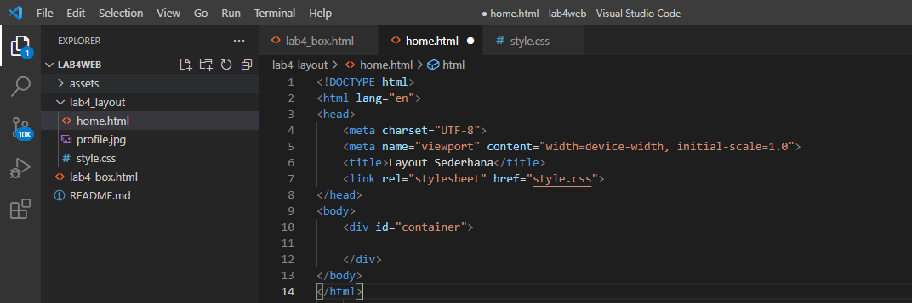

| Nama      | Aditya Bani Isro |
| ----------- | ----------- |
| NIM     | 312010134       |
| Kelas   | TI.20.A.1        |

## Langkah langkah praktikum 4
Membuka text editor, Saya menggunakan Visual Studio Code

Periapan membuat dokumen HTML dengan nama file lab4_web.html seperti berikut.

## Membuat Box Element
Kemudian tambahkan kode untuk membuat box element dengan tag div seperti berikut.

## CSS Float Property
Selanjutnya tambahkan deklarasi CSS pada head untuk membuat float element, seperti berikut.

Kemudian buka browser untuk melihat hasilnya

## Mengatur Clearfix Element
Clearfix digunakan untuk mengatur element setelah float element. Propery clear digunakan untuk mengaturnya.

Tambahkan element div lainnya setelah div3 sebagai berikut.

Kemudian atur property clear pada CSS, seperti berikut.

Selanjutnya buka browser dan refresh kembali.

Lakukan eksperimen terhadap penggunaan property clear dengan nilai lainnya (left, both, right), dan amati perubahannya. 

## Membuat Layout Sederhana
Buat folder baru dengan nama lab4_layout, kemudia buatlah file baru didalamnya dengan nama home.html dan file css dengan nama style.css

Kemudian tulis kode berikut.

Kemudian buka browser dan lihat hasilnya.

Kemudian tambahkan kode CSS untuk membuat layoutnya.

Kemudian lihat hasilnya pada browser.

## Membuat Navigasi
Kemudian selanjutnya mengatur navigasi

Kemudian lihat hasilnya.

## Membuat Hero Panel
Selanjutnya membuat hero panel. Tambahkan kode HTML dan CSS seperti berikut.

## Mengatur Layout Main dan Sidebar
Selanjutnya mengatur main content dan sidebar, tambahkan CSS float.

## Membuat Sidebar Widget
Kemudian selanjutnya menambahkan element lain dalam sidebar.

Kemudian tambahkan CSS.

## Mengatur Footer
Selanjutnya mengatur tampilan footer. Tambahkan CSS untuk footer.

## Menambahkan Elemen lainnya pada Main Content

Kemudian tambahkan CSS

Lihat hasilnya di browser

## Menambahkan Content Artikel

Kemudian Tambahkan CSS

## Pertanyaan dan Tugas
1. Tambahkan Layout untuk menu About
=> buat single layout yang berisi deskripsi, portfolio, dll
2. Tambahkan layout untuk menu Contact
=> yang berisi form isian: nama, email, message, dll

## Jawab
## 1. Buat html seperti berikut

Kemudian tambahkan CSS.

Lalu lihat hasilnya

## 2. Buat html seperti berikut

Kemudian tambahkan CSS.

Lalu lihat hasilnya

